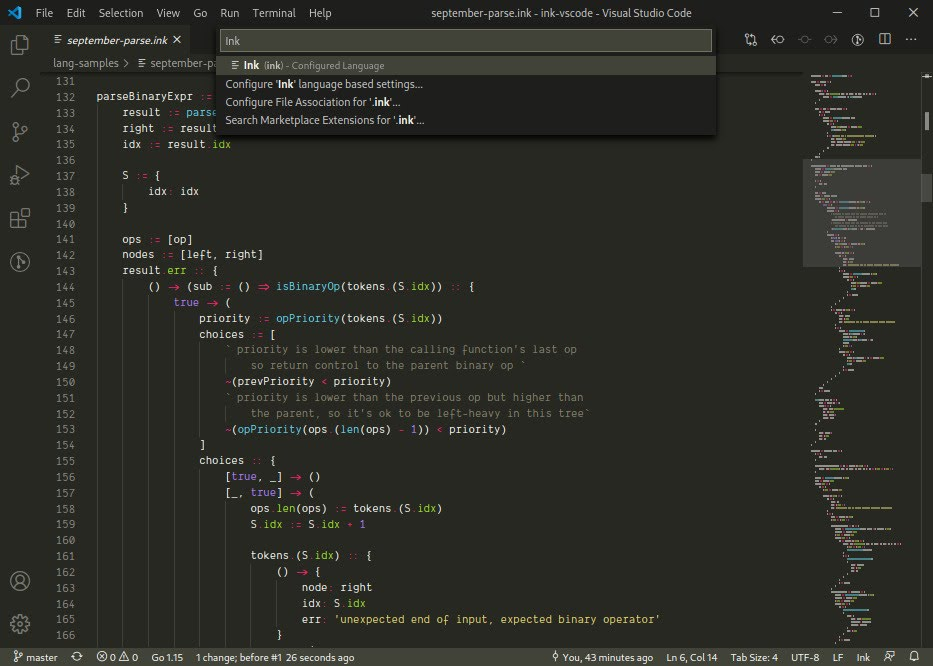

# ink-vscode

**ink-vscode** adds support for the [Ink programming language](https://github.com/thesephist/ink) to [Visual Studio Code](https://code.visualstudio.com/). Currently, the extension adds syntax highlighting support.

## Installing and developing locally

As of today, this extension is not in the VSCode Marketplace for you to install from the store yet. So to use the extension, you'll need to install it locally.

At time of writing, you can find how to do this in the [Visual Studio Code documentation page](https://code.visualstudio.com/api/working-with-extensions/publishing-extension#your-extension-folder).

On Linux and macOS, this involves copying or cloning this repository into `~/.vscode/extensions/` on your user directory, then reloading Visual Studio Code. The editor will automatically detect hew `.ink` files as Ink programs and add syntax highlighting.
